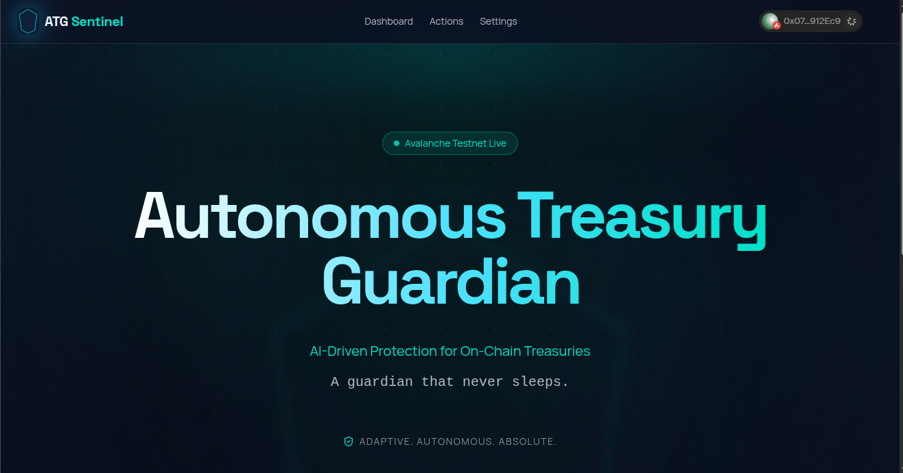

# Autonomous Treasury Guardian (ATG)




**Autonomous Treasury Guardian** is a decentralized, AI-powered treasury management system designed for DAOs and organizations on Avalanche. It combines on-chain transparency with off-chain AI intelligence to automate risk management, asset rebalancing, and operational payments.

## 🌟 Core Features

### 🤖 AI-Driven Autonomy
- **Risk Engine**: Continuous monitoring of market volatility (via CoinGecko) and vault health.
- **Automated Proposals**: The AI agent automatically proposes rebalances (AVAX/USDC) when risk thresholds are breached or portfolio allocation drifts.
- **Agent API**: Integrated Next.js API routes (`/api/agent/*`) for risk evaluation and on-chain action triggering.
- **Intelligent Execution**: Server-side signer (Viem) automatically submits proposals to the `ActionExecutor` contract.

### 🛡️ Advanced Governance
- **Role-Based Access Control**: Granular permissions via `PermissionManager` (Governance, Executor, Agent roles).
- **On-Chain Risk Parameters**: Adjustable thresholds for max rebalance size, volatility limits, and runway requirements.
- **Guardian Controls**: System pause/unpause and role revocation capabilities.

### 🏛️ Treasury Dashboard
- **Real-Time Monitoring**: Live feed of treasury balances (AVAX, USDC) and asset allocation.
- **Activity Feed**: Immutable log of all agent proposals, executed actions, and system telemetry.
- **Interactive Settings**: UI for managing risk configurations and assigning system roles.

## 🏗️ System Architecture

The system consists of three layers:

1.  **Smart Contracts (Avalanche)**:
    *   `TreasuryVault`: Holds assets and enforces withdrawal logic.
    *   `ActionExecutor`: Gateway for executing authorized actions (swaps, payments).
    *   `RiskParameters`: Stores on-chain risk rules.
    *   `PermissionManager`: Manages access control.
    *   `AgentAuth`: Authenticates AI agents.

2.  **AI Agent Layer (Next.js API)**:
    *   **Orchestrator**: Coordinates the full agent cycle (Market Data -> Risk Engine -> Proposal Engine -> Execution).
    *   **Risk Engine**: Evaluates on-chain state against risk parameters and market volatility.
    *   **Wallet**: Server-side signer that submits proposals directly to the blockchain.

3.  **Frontend (Next.js)**:
    *   User interface for human oversight, approval, and configuration.

## 🚀 Deployed Contracts (Avalanche Fuji)

| Contract | Address |
|----------|---------|
| **TreasuryVault** | `0x565435bAf0C6A9E06BE4e7F00fE08C95d36F247b` |
| **ActionExecutor** | `0x4DabF129f9175a84D0E6caD48d14Be65bA5910F5` |
| **RiskParameters** | `0xEC85cC46c6C514a6e05361f682c884d30d0cc9D3` |
| **PermissionManager** | `0x3905052fB9d1502B246442945Eb1DC9573Be4708` |
| **AgentAuth** | `0xf6Cd6D7Ee5f2F879A872f559Ef8Db39d73a69f8e` |
| **MockSwap** | `0x35A4E34953dC9720223607921891Fc67a857A84C` |

## 🛠️ Getting Started

### Prerequisites
- Node.js 20+
- pnpm or npm
- An Avalanche Fuji wallet with funds

### Installation

1.  **Clone the repository**
    ```bash
    git clone git@github.com:gethsun1/autonomous-treasury-guardian.git
    cd autonomous-treasury-guardian
    ```

2.  **Install dependencies**
    ```bash
    pnpm install
    ```

3.  **Configure Environment**
    Create a `.env.local` file:
    ```env
    # Blockchain
    NEXT_PUBLIC_CHAIN_ID=43113
    NEXT_PUBLIC_RPC_URL=https://api.avax-test.network/ext/bc/C/rpc
    
    # Contract Addresses (Already configured in lib/contracts.ts defaults)
    NEXT_PUBLIC_TREASURY_VAULT_ADDRESS=0x565435bAf0C6A9E06BE4e7F00fE08C95d36F247b
    NEXT_PUBLIC_ACTION_EXECUTOR_ADDRESS=0x4DabF129f9175a84D0E6caD48d14Be65bA5910F5
    NEXT_PUBLIC_RISK_PARAMETERS_ADDRESS=0xEC85cC46c6C514a6e05361f682c884d30d0cc9D3
    NEXT_PUBLIC_PERMISSION_MANAGER_ADDRESS=0x3905052fB9d1502B246442945Eb1DC9573Be4708
    NEXT_PUBLIC_AGENT_AUTH_ADDRESS=0xf6Cd6D7Ee5f2F879A872f559Ef8Db39d73a69f8e
    
    # Agent Configuration (Backend)
    AGENT_PRIVATE_KEY=0x... # Private key for the server-side agent wallet
    
    # Reown / WalletConnect
    NEXT_PUBLIC_WALLETCONNECT_PROJECT_ID=your_project_id
    ```

4.  **Run the Development Server**
    ```bash
    pnpm dev
    ```

## 🧪 Usage Guide

### 1. Dashboard
Visit the main dashboard to see the current "Runway Status", "Risk Gauge", and "Activity Feed". The activity feed updates in real-time via contract event listeners.

### 2. Risk Configuration
Navigate to **Settings**. Here you can:
- Update `Max Rebalance BPS` (e.g., 500 for 5%).
- Update `Volatility Threshold`.
- Update `Min Runway Months`.
*Note: You must have the Governance role to update these.*

### 3. Role Management
In **Settings**, use the **Access Control** panel to:
- Assign the `AGENT` role to your server-side wallet.
- Grant `EXECUTOR` roles to trusted team members.

### 4. Testing the Agent
You can manually trigger the AI risk analysis by hitting the API endpoint:
```bash
curl -X POST http://localhost:3000/api/agent/propose
```
If a risk is detected (simulated in `lib/riskEngine.ts`), the agent will automatically propose a remedial action on-chain.

## 🔒 Security

- **Private Keys**: The frontend never accesses your private keys. The `AGENT_PRIVATE_KEY` is only used server-side for the automated agent.
- **Permissioned Execution**: Even if the agent proposes an action, it must pass on-chain validation checks in `ActionExecutor`.
- **Rate Limiting**: Agent endpoints should be protected in production.

---

Built with ❤️ on Avalanche.
